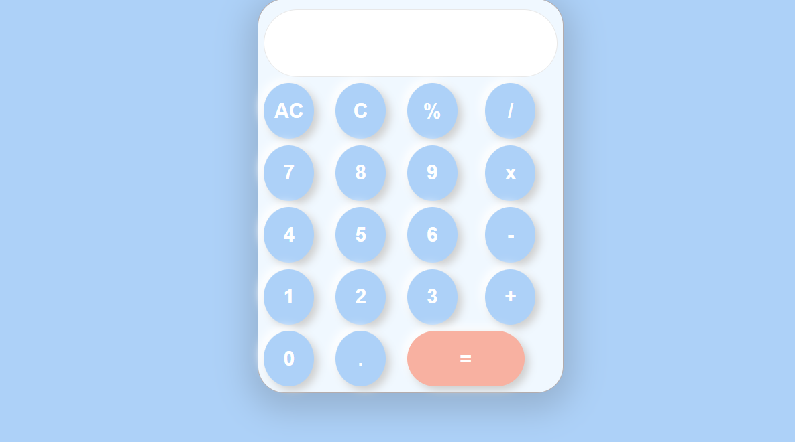

# 🧮 Arithmetic Calculator

A basic calculator built with HTML and CSS that performs simple arithmetic operations like addition, subtraction, multiplication, and division.

---

## 🔧 Features

- Clean user interface using only HTML and CSS
- Supports:

  - Addition (+)
  - Subtraction (−)
  - Multiplication (×)
  - Division (÷)

- Responsive Layout

---

## 📦 Installation

1. **Clone the repository**

   ```bash
   git clone https://github.com/FatimaToleed/arithmetic-calculator.git
   ```

2. **Open the project folder**

3. **Run the calculator**

   - Open `index.html` in your web browser.

---

## 🖼️ Screenshot


